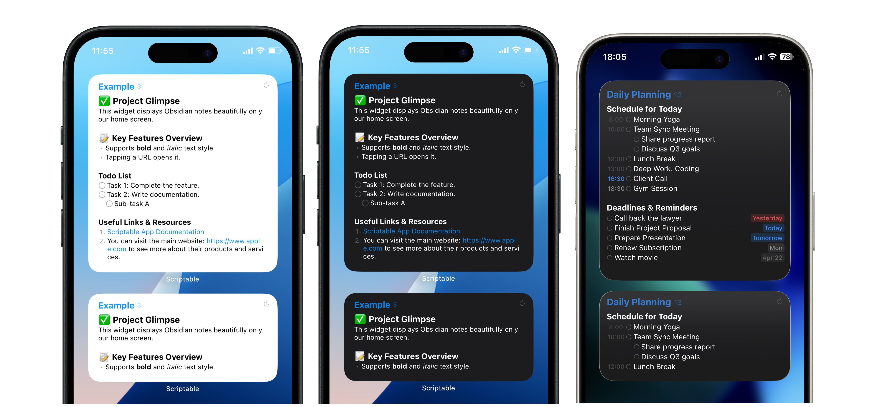

[English](README.md)
# Obsidian Widget for Scriptable

ObsidianのノートをiOS/iPadOSのホーム画面ウィジェットに表示するためのScriptable用スクリプトです。単なるメモ表示に留まらず、タスクの時刻を解析して「今やるべきこと」を視覚化するインテリジェントなタイムブロック機能を搭載しています。



## 特徴

-   **Markdownサポート**: 見出し (`#`), ToDoリスト (`- [ ]`), 箇条書き, 番号付きリストなどの描画に対応。
-   **タイムブロック機能 (New!)**: タスク内の時刻を解析し、現在時刻と照らし合わせて「過去（終了）・現在（進行中）・未来（未着手）」を自動で色分けします。
-   **自動ソート (New!)**: 記述順に関わらず、タスクを時刻の早い順に自動で並べ替えてスケジュール表を作成します。
-   **日付・時刻バッジ (New!)**: 期限や時間を視覚的なバッジとして表示。期限の近さ（昨日・今日・明日・1週間以内など）に応じてバッジの色が動的に変化します。
-   **Unscheduledセクション (New!)**: 時刻が設定されていないタスクは、自動的に「Unscheduled（未定）」セクションにまとめられ、予定とToDoを明確に分離します。
-   **日本語日付対応 (New!)**: 「今日」「明日」や曜日の日本語表示、および日本で一般的な日付形式のパースに対応しています。
-   **Obsidian連携**: ウィジェットをタップすると、Obsidianアプリで該当のノートを直接開くことができます。

## 導入と設定

### Step 1: ファイルのダウンロードと配置

1.  このリポジトリからファイルをダウンロードします。
2.  スクリプトファイル `obsidian_widget.js` をScriptableアプリにインストールします。
3.  `Images` フォルダを、iCloud DriveのScriptable用フォルダの直下に配置します。

    ```
    iCloud Drive
    └── Scriptable
        ├── obsidian_widget.js   (スクリプト本体)
        └── Images               (このフォルダを配置)
            ├── 0.png
            ...
            └── square.png
    ```

### Step 2: ScriptableのFile Bookmarks設定

ウィジェットに表示したいMarkdownファイルが保存されているフォルダをScriptableに登録します。

1.  Scriptableアプリを開き、右上の歯車アイコンから `設定` > `File Bookmarks` に移動します。
2.  `Add Bookmark` をタップし、ObsidianのVaultフォルダなど、Markdownファイルが格納されているフォルダを選択します。
3.  **ブックマーク名**（例: `inbox`）を入力して保存します。この名前は次のステップで使用します。

> **Note**
> このスクリプトは基本的にObsidianのVaultフォルダを対象としていますが、Markdownファイルが直下に保存されているフォルダであれば、どのフォルダでも利用可能です。

### Step 3: スクリプトの編集

インストールした `obsidian_widget.js` を開き、以下の項目を設定します。

1.  **`BOOKMARKED_FOLDER_NAME` の設定**
    Step 2で設定したブックマーク名を、`BOOKMARKED_FOLDER_NAME` 変数に設定します。

    ```javascript
    // 例
    const BOOKMARKED_FOLDER_NAME = 'inbox';
    ```

2.  **`FILE_NAME_RUNS_IN_APP` の設定**
    Scriptableアプリ内でスクリプトを実行した際のテスト表示に使われるファイル名です。ホーム画面でのウィジェット表示には影響しませんが、Scriptableアプリ内でのデバッグ作業時などにここで設定したファイルが表示されます。ブックマークしたフォルダ内に実在するファイル名（`.md`は不要）を設定してください。

    ```javascript
    // 例: example.mdを表示する場合
    const FILE_NAME_RUNS_IN_APP = 'example';
    ```

3.  **デバイスと文字タイプの設定**
    スクリプトの冒頭で、`isPhone` と `USE_FULL_WIDTH_CHARS` を設定します。これは正しいレイアウトと文字の折り返しのために重要です。

    ```javascript
    const isPhone = true; // iPhoneの場合は `true`、iPadの場合は `false` に設定します。
    const USE_FULL_WIDTH_CHARS = false; // ノートが主に日本語や中国語などの全角文字で構成されている場合は `true` に設定します。
    ```

### Step 4: ウィジェットの配置

1.  ホーム画面を長押しして、左上の「+」からウィジェットを追加します。
2.  `Scriptable` を選択し、好きなサイズのウィジェットをホーム画面に配置します。
3.  配置したウィジェットを長押しし、「ウィジェットを編集」を選択します。
    -   **Script**: `obsidian_widget` を選択します。
    -   **Parameter**: ウィジェットに表示したいノートのファイル名（`.md`は不要）を入力します。

これで設定は完了です！ホーム画面にObsidianのノートが表示されます。

## 日付・時刻の記述形式

タスクの末尾に日付や時刻を記述することで、スクリプトが自動的に認識します。

-   **時刻の認識**: `13:00`, `1300`, `9:30` など
    -   例: `- [ ] ミーティング 14:00`
-   **日付の認識**: `MM/DD`, `YY/MM/DD`, `YYMMDD` など
    -   例: `- [ ] 提出期限 04/15`
-   **組み合わせ**: 
    -   例: `- [ ] レポート作成 04/13 15:00`

> **Note**: 時刻が入力されると、そのタスクは「現在進行中」かどうかが判定され、ウィジェット上で青色にハイライトされます（タイムブロックモード）。

## カスタマイズ

スクリプト冒頭の `== Basic Display Settings ==` および `== Color and Style Settings ==` の項目を編集することで、ウィジェットの見た目をカスタマイズできます。

### 基本表示設定

| 定数名                       | 説明                                                                                                                                                                             |
| :--------------------------- | :------------------------------------------------------------------------------------------------------------------------------------------------------------------------------- |
| `isPhone`                    | 使用するデバイスがiPhoneの場合は `true`、iPadの場合は `false` に設定します。iPhoneとiPadではウィジェットのサイズや余白計算が異なるため、この設定を間違えると表示が崩れる原因となります。 |
| `USE_FULL_WIDTH_CHARS`       | ノートが主に日本語や中国語などの全角文字で構成されている場合に `true` に設定します。これにより、自動改行の精度が向上します。                                                          |
| `FONT_SIZE`                  | フォントサイズを数値で指定します。                                                                                                                                     |
| `LINE_SPACING`               | 各行の間の余白を数値で指定します。                                                                                                                                                 |
| `PARTITION_STRING`           | ノート内にこの文字列（デフォルトは `---`）があると、そこから下の内容はウィジェットに表示されません。                                                                                |
| `SHOW_FIRSTLINE_AS_PLAINTEXT`| `true`にすると、ウィジェットの1行目を通常のテキストスタイルで表示します。`false`だと特別なスタイルが適用されます。                                                                   |
| `SHOW_FILENAME_ON_FIRSTLINE` | `true`にすると、ウィジェットの1行目にファイル名を表示します。                                                                                                                    |
| `SHOW_TASK_NUMBER`           | `true`にすると、未完了のタスク数をファイル名の横に表示します。                                                                                                                   |

### タイムブロック機能関連の設定

| 定数名                   | 説明                                                                |
| :----------------------- | :------------------------------------------------------------------ |
| `USE_JAPANESE_TIME_FORMAT` | `true` で「今日」「明日」や曜日の日本語表示を有効化。 |
| `AUTO_SORT_BY_TIME` | `true` で時刻順に自動ソート。`false` で記述順に表示。 |

### 色とスタイルの設定

| 定数名                   | 説明                                                                |
| :----------------------- | :------------------------------------------------------------------ |
| `DARK_BACKGROUND_COLOR`  | ダークモード時のウィジェット背景色を16進数カラーコードで指定します。  |
| `LIGHT_BACKGROUND_COLOR` | ライトモード時のウィジェット背景色を16進数カラーコードで指定します。  |
| `FIRST_LINE_COLOR_LIGHT` | ライトモード時の1行目（ファイル名など）のテキスト色を指定します。     |
| `FIRST_LINE_COLOR_DARK`  | ダークモード時の1行目（ファイル名など）のテキスト色を指定します。     |

### 高度なスタイル設定 (`CONFIG` オブジェクト)

`CONFIG` オブジェクトやスクリプトの他の部分を編集することで、さらに詳細なスタイル調整が可能です。

-   **要素のスタイル**: `CONFIG` オブジェクト内で、`h1`, `h2`, `url` などの要素の色をライトモード (`color_light`) とダークモード (`color_dark`) 別に設定できます。
    
    > **注意**
    > `fontSizeScale` は各要素の相対的な大きさを決定します。この値を変更すると、行の折り返し計算がずれてレイアウトが崩れる可能性があります。変更にはご注意ください。

-   **バッジのスタイル**: `CONFIG.dueDateTime` オブジェクト内の値を変更することで、バッジの色や透明度を細かく調整できます。

    -   **timeCurrent**: 現在時刻に該当するタスクの色（デフォルト: 青）。
    -   **timePast**: 終了した時刻のタスクの色（デフォルト: 控えめなグレー）。
    -   **earlier**: 期限が過ぎたタスクの色（デフォルト: 赤）。

-   **チェックボックスのスタイル変更**: デフォルトのチェックボックスは円形 (`SFSymbol.named('circle').image`) です。四角いチェックボックスを使用するには、`addListMarker` 関数を編集します。`Images` フォルダに `square.png` ファイルがあることを確認してください。

    ```javascript
    // addListMarker 関数内:
    function addListMarker(stack, config, type, listNumber) {
        switch (type) {
            case 'todo':
                // const todoImage = SFSymbol.named('circle').image;
                const todoImage = storeImage('square.png'); // この行のコメントを解除すると、四角いチェックボックスが使えます
                addImage(stack, todoImage, config);
                break;
            // ...
        }
    }
    ```

## 注意点

-   **ファイル階層について**
    -   このスクリプトは、File Bookmarksで指定したフォルダの**直下にあるファイル**のみを表示できます。サブフォルダ内のファイルはサポートされていません。
-   **タイムブロックの挙動**: タスクの「終了時刻」は、「次のタスクの開始時刻」として計算されます。その日の最後のタスクは、24:00までが「現在進行中」の範囲となります。

## 謝辞

このスクリプトは、以下のプロジェクトを参考に作成されました。

-   ぽっぽさん: [【Scriptable】Obsidianのメモをホーム画面に表示する](https://note.com/walking_poppo/n/n31e5ef576e72)
-   Angus Thompson: [obsidian-scriptable-tasks-widget](https://github.com/angus-thompson/obsidian-scriptable-tasks-widget)